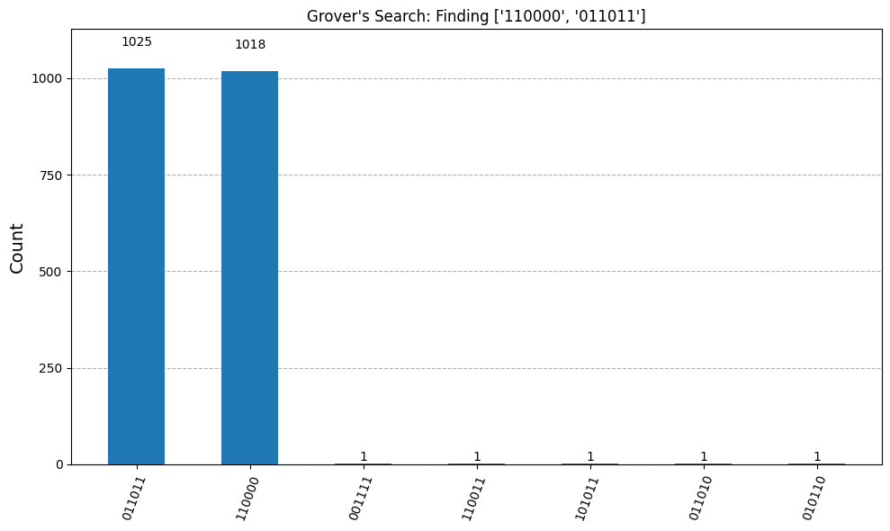

# Grover's Search Algorithm in Qiskit

A clean, well-documented Python implementation of Grover's search algorithm using Qiskit. This project demonstrates how to efficiently find one or more marked items in an unstructured quantum database, showcasing a fundamental quantum advantage.



## Key Features

- **Multi-Target Search:** Capable of searching for multiple target states simultaneously.
- **Pure Phase Oracle:** Implemented using a phase-flip oracle that requires no ancilla qubits, making it more resource-efficient.
- **Automatic Iteration Calculation:** Automatically determines the optimal number of Grover iterations for the highest success probability.
- **Modular Code:** Structured with clear, single-responsibility functions for the oracle, diffuser, and circuit assembly, making it easy to read and understand.

---

## How It Works

Grover's algorithm provides a quadratic speedup over classical algorithms for unstructured search problems. The magic happens by repeating two key steps to amplify the probability amplitude of the target states.

This implementation closely follows the methodology described in *Fundamentals of Quantum Information* by Hiroyuki Sagawa and Tomahiro Yoshida.

### 1. The Oracle (`U_f`)

The first step is to "mark" the items we're looking for. The oracle is a quantum operator that selectively applies a negative phase (`-1`) to the target states while leaving all other states unchanged.

- If `|x⟩` is a target state: `U_f |x⟩ = -|x⟩`
- If `|x⟩` is not a target state: `U_f |x⟩ = |x⟩`

This phase difference is invisible if you measure right away, but it's the key ingredient for the next step.

### 2. The Diffuser (`D`)

The second step is the amplifier, also known as the "inversion about the mean" operator. This operator takes the marked states and dramatically increases their amplitudes. It's constructed as follows:

`D = H^n * U_0 * H^n`

- `H^n`: A Hadamard gate applied to every qubit, which creates a uniform superposition.
- `U_0`: A special oracle that only marks the `|00...0⟩` state.

When combined, these gates create an operator that reflects every state's amplitude about the average amplitude. This clever trick causes destructive interference for non-target states and constructive interference for the target states, rapidly boosting their measurement probability.

### 3. Iteration

A single Grover operator is the sequence of these two steps: `G = D * U_f`.

This operator `G` is applied `k` times to the initial uniform superposition. The optimal number of iterations `k` is calculated to maximize the probability of measuring a target state:

`k ≈ (π / 4) * sqrt(N / M)`

where `N` is the total number of states (`2^n`) and `M` is the number of target states.

---

## Installation & Requirements

To run this project, you'll need Python 3. It's highly recommended to use a virtual environment to manage dependencies.

1.  **Clone the repository and navigate to the project directory:**

    ```bash
    git clone https://github.com/qvazarius648/grovers-search-algorithm.git
    cd grovers-search-algorithm
    ```

2.  **Create and activate a virtual environment (optional but recommended):**
    ```bash
    # For Unix/macOS
    python3 -m venv venv
    source venv/bin/activate

    # For Windows
    python -m venv venv
    .\venv\Scripts\activate
    ```

3.  **Install the required dependencies from the `requirements.txt` file:**
    ```bash
    pip install -r requirements.txt
    ```


---

## Usage

This project is structured as a Jupyter Notebook (`.ipynb`) file, which allows for interactive execution and visualization of each step.

1.  **Start Jupyter Notebook or JupyterLab:**
    After installing the requirements and activating your environment, launch Jupyter from your terminal:
    ```bash
    # For the classic Notebook interface
    jupyter notebook

    # Or for the more modern JupyterLab interface
    jupyter lab
    ```
    This will open a new tab in your web browser showing the file explorer.

2.  **Open and Run the Notebook:**
    Navigate to the project directory in the Jupyter interface and click on the `groverssearch.ipynb` file to open it.

3.  **Execute the Code:**
    You can run the entire notebook by selecting "Cell" -> "Run All" from the menu bar. Alternatively, you can execute each cell individually by selecting it and pressing `Shift + Enter`.

4.  **Modify the Search:**
    To search for different states, locate the main execution cell at the bottom of the notebook and modify the `target_keys` list directly:
    ```python
    # In the final code cell:
    
    # Define the states to find
    target_keys = ['101', '010'] # Change these values to your desired targets
    
    # ... rest of the code
    ```
    After changing the list, simply re-run that cell and the subsequent ones to see the new results.

    
---

## License

This project is licensed under the MIT License. See the `LICENSE` file for details.
